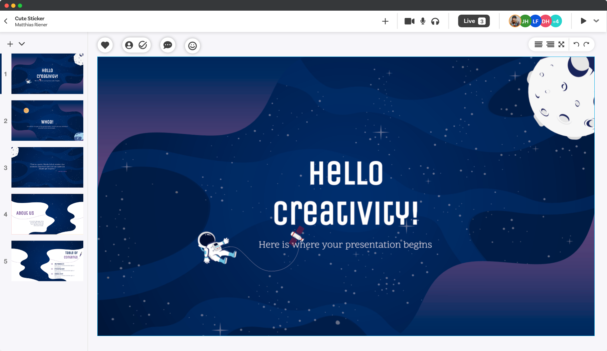
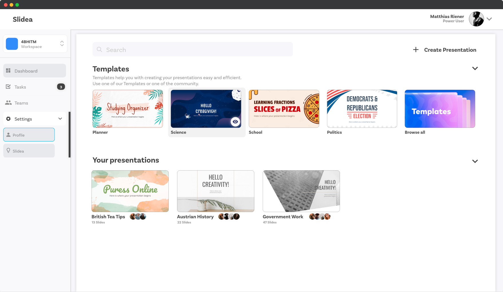
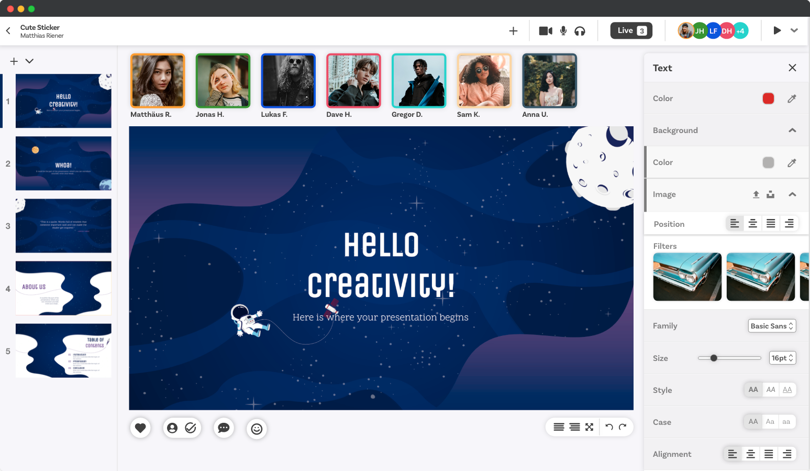
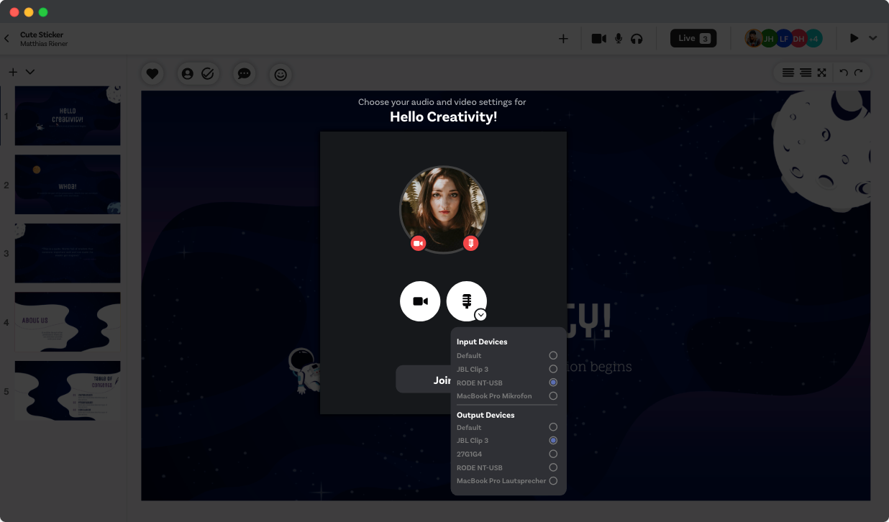

# Slidea
**ITP-Projekt** 
**Klasse:** 4BHITM 
**Jahr:** 2020/21 
**Projektleiter:** Riener Matthias (matti.riener@gmail.com) 
**Team:** Friesenecker Lukas, Hauser David, Himmetsberger Jonas 

  
<b>Inhaltsverzeichnis</b>

  <ol>
    <li><a href="#Beschreibung">Beschreibung</a></li>
    <li><a href="#Bilder">Bilder</a></li>
    <li><a href="#Technologien">Technologien</a></li>
  </ol>

### Beschreibung
Mit Slidea kann ein Benutzer kostenfrei moderne **Präsentationen** erstellen. Diese können dann durch
einen Einladungslink mit anderen Benutzern geteilt, und **in Echtzeit bearbeitet** werden. Des weiteren
wird durch einen **Sprach- und Videochat** für die Kommunikation während der Präsentationserstellung
gesorgt.

### Technologien
* HTML
* CSS
* JS
* Python

### Bilder

